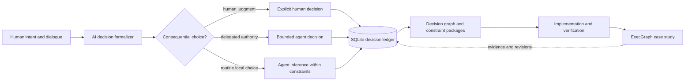
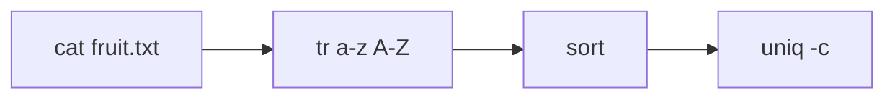

# DecisionLedger

**A one-day experiment in turning AI-assisted software development into an auditable graph of human choices, agent decisions, constraints, and revisions.**


On March 9, 2026, I explored three connected questions:

1. Can AI actively formalize consequential software decisions instead of leaving them implicit in conversation?
2. Can a SQLite ledger preserve why a system took its present form, including alternatives, constraints, dependencies, revisions, and the boundary between human judgment and agent autonomy?
3. Can that method carry a non-trivial systems idea from problem framing into running, verified code?

The result is `DecisionLedger`: an experimental development method and working design-state tool built around SQLite. `ExecGraph`, a runnable C++17 process-graph prototype, is the case study produced through that method.

This repository is deliberately presented as an experiment, not a finished product. Its main subject is accountable AI-assisted development; ExecGraph is both evidence that the method produced real systems code and a secondary idea worth inspecting in its own right.

## The central thesis

Most AI coding workflows optimize code generation. DecisionLedger explores whether AI can instead improve **decision accountability**.

The AI is not merely a note-taker. It should recognize when development reaches a consequential decision boundary and require one of three explicit outcomes:

1. the human makes the decision
2. the human consciously delegates the decision to the agent
3. the agent makes a bounded local choice under previously accepted constraints

The system should not silently glide past an expensive ambiguity. At the same time, it should not interrupt the human for every routine implementation detail. The governing rule is:

> If an implementation agent could make an expensive wrong guess, formalize the decision or constraint. If the choice is local, routine, and cheap to correct, let the agent infer it within the recorded boundary.

Over a development sequence, this produces something more useful than chat history: an inspectable account of **what was decided, why, by whom, under which authority, and what later work depended on it**.

## The idea in one diagram



This is a graph rather than a simple tree because real software decisions share dependencies, constrain multiple components, and may later be superseded. SQLite preserves the ledger history; explicit relationships make the reasoning traversable.

## What the ledger records

The current `autoSWE` CLI is the prototype implementation of the DecisionLedger method. It treats software design as durable project state rather than disposable conversational context.

It stores:

- projects and staged design nodes
- proposed, accepted, rejected, and superseded decisions
- rationale, alternatives, and expected impact
- versioned design artifacts
- dependencies and unresolved work
- leaf-module constraint packages
- an append-only event history
- a lightweight repository code index

Work advances through explicit stages:

```text
problem → requirements → solution framing → domain and behavior
        → decomposition → contracts → security → operations
        → verification → implementation handoff
        → discovery → implementation design → execution
```

At the end of the one-day run, the working ledger contained 40 design nodes, 29 artifacts, 34 decisions, 13 constraint packages, and 264 recorded state-change events. A sanitized snapshot is included at `.design/design.db`; generated code-index rows and machine-specific paths were removed before publication. The schema is implemented in [`autoswe/cli.py`](autoswe/cli.py), and the experiment receipt is preserved in [`docs/experiment-report.md`](docs/experiment-report.md).

The prototype records the substance and lifecycle of decisions, but it does not yet encode explicit actor and delegation fields. The clearest next schema increment would distinguish:

- `human_decision`: explicitly chosen by the user
- `delegated_agent_decision`: consciously delegated and decided by the agent
- `bounded_agent_inference`: a local choice made inside accepted constraints

That attribution is part of the central thesis and should become queryable rather than remain an assumption inferred from surrounding events.

Resume a local design ledger with:

```bash
python3 -m autoswe resume
```

See [`workflows/autoswe/README.md`](workflows/autoswe/README.md) for the canonical workflow and [`docs/autoswe/README.md`](docs/autoswe/README.md) for its rationale and tooling notes.

## Case study: ExecGraph

The product hypothesis is that autonomous agents should not receive an unrestricted shell. Every executable action should pass through a controlled runtime that can:

- validate what may run
- supervise the process and its descendants
- constrain time and resources
- capture outputs and terminal causes
- associate actions with their causal parent
- preserve an inspectable execution history
- eventually run inside a strongly isolated sandbox

That changes the graph from merely a predefined workflow into a potential **flight recorder and capability boundary for autonomous agents**.

### Implemented in the prototype

- C++17 process runtime for Linux
- sequential workflow and directed-acyclic-graph execution
- graph parsing, cycle rejection, and topological ordering
- owned process groups with timeout-driven `SIGTERM`/`SIGKILL`
- stdout and stderr capture
- structured JSONL events for workflow, graph, node, process, and stream activity
- SQLite migrations and revision-checked graph persistence
- arena-backed immutable graph snapshots
- relative working-directory preservation
- 11 CTest smoke tests
- ASan/UBSan, TSan, and Valgrind verification entry points

### Designed, but not implemented

- secure container or microVM sandboxing
- capability and approval policies
- network and secret-access mediation
- filesystem-diff and artifact provenance
- persistent append-only execution ledger
- typed ports across process boundaries
- long-lived service orchestration
- caching, scheduling, and a public API server
- replay and rollback of complete agent runs

The distinction matters: **the current code is an execution-runtime proof of concept, not a production security boundary.** See [`SECURITY.md`](SECURITY.md) and [`docs/agent-execution-ledger.md`](docs/agent-execution-ledger.md).

## Runnable example

The sample graph connects ordinary Linux programs:

```text
node source cat fruit.txt
node upper tr a-z A-Z
node sorted sort
node count uniq -c
edge source upper
edge upper sorted
edge sorted count
```

Conceptually:



Build and run it on Linux:

```bash
cd exec_graph
cmake --preset debug
cmake --build ../build/exec_graph
ctest --test-dir ../build/exec_graph --output-on-failure

../build/exec_graph/eg_demo_pipeline \
  --graph examples/toy_process.graph \
  --emit-events-jsonl
```

The runtime emits machine-readable lifecycle records alongside the graph result, allowing an observer to reconstruct which graph and process actions started, completed, failed, timed out, or produced output.

An abridged successful trace looks like this:

```jsonl
{"name":"graph.started","node_count":4,"sink_count":1}
{"name":"graph.node.started","subject":"source","completed_node_count":0}
{"name":"process.completed","subject":"source","exit_code":0,"terminal_cause":"exit_zero"}
{"name":"graph.completed","node_count":4,"completed_node_count":4}
```

## Repository map

| Path | Purpose |
| --- | --- |
| [`autoswe/`](autoswe/) | SQLite-backed DecisionLedger prototype and design-state CLI |
| [`workflows/autoswe/`](workflows/autoswe/) | Canonical staged decision and development workflow |
| [`exec_graph/`](exec_graph/) | C++17 case study: runtime, graph core, persistence, examples, and tests |
| [`docs/design.md`](docs/design.md) | Full ExecGraph platform specification |
| [`docs/exec-graph/`](docs/exec-graph/) | Ordered subsystem and implementation specifications |
| [`docs/experiment-report.md`](docs/experiment-report.md) | Evidence and conclusions from the one-day run |
| [`docs/agent-execution-ledger.md`](docs/agent-execution-ledger.md) | The security and provenance idea beyond the prototype |

## What the experiment demonstrated

The experiment did not prove that an AI can autonomously build a production systems platform in one day. It demonstrated something narrower and useful:

- structured state allowed the agent to resume from explicit project facts instead of reconstructing intent from conversation
- consequential choices were recorded with rationale, alternatives, impact, and lifecycle state
- architectural choices survived into implementation packets and code boundaries
- the workflow produced a functioning native prototype rather than only design prose
- verification exposed concrete runtime concerns: path resolution, migration idempotency, process ownership, timeouts, and event completeness
- the system stopped at an honest implementation boundary with significant security and platform work still outstanding

The primary opportunity is not another code-generating agent. It is an AI-mediated decision ledger that makes human authority, delegated agent judgment, constraints, and revisions inspectable across the life of a software system.

ExecGraph suggests a complementary direction: an agent-independent execution broker that could make runtime actions as inspectable as the design decisions that authorized them. Together, the two ideas point toward end-to-end accountability—from **why an agent was allowed to act** to **what it actually executed**.

## Status

This repository is a preserved research prototype from a single-day build. DecisionLedger does not yet provide complete human/agent attribution, and ExecGraph is not a production security boundary. The remaining method and architecture are documented so both ideas can be inspected, evaluated, or resumed without pretending that the larger system already exists.

## License

MIT. See [`LICENSE`](LICENSE).
