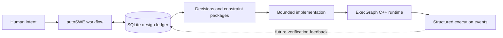
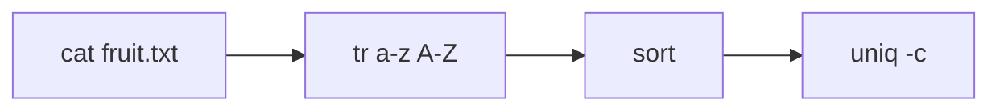

# ExecGraph

**A one-day experiment in ledger-driven AI software development and observable agent execution.**


On March 9, 2026, I explored two connected questions:

1. Can an AI agent iteratively design and implement a non-trivial system while a SQLite ledger preserves decisions, dependencies, constraints, and progress across stages?
2. Could the system being built become a secure execution layer that records a causal history of what an autonomous agent actually ran?

The result is deliberately presented as an experiment, not a finished product. It contains a working design-state tool, an extensive architecture, and a runnable C++17 proof of concept for process-graph execution, persistence, supervision, and structured runtime events.

## The idea in one diagram



`autoSWE` is the experimental development method. `ExecGraph` is the system that method was used to design and begin implementing. They are related, but they are not the same product.

## Experiment A: autoSWE

The first experiment treats software design as durable project state rather than disposable chat context.

The Python CLI stores the following in SQLite:

- projects and staged design nodes
- accepted and rejected decisions
- versioned design artifacts
- dependencies and unresolved work
- leaf-module constraint packages
- an append-only event history
- a lightweight repository code index

The central rule is:

> If an implementation agent could make an expensive wrong guess, specify the constraint. If the choice is local, routine, and cheap to correct, let the implementation agent infer it.

This attempts to preserve deep design reasoning without producing exhaustive implementation instructions. Work advances through explicit stages:

```text
problem → requirements → solution framing → domain and behavior
        → decomposition → contracts → security → operations
        → verification → implementation handoff
        → discovery → implementation design → execution
```

At the end of the one-day run, the working ledger contained 40 design nodes, 29 artifacts, 34 decisions, 13 constraint packages, and 264 recorded state-change events. A sanitized snapshot is included at `.design/design.db`; generated code-index rows and machine-specific paths were removed before publication. The schema is implemented in [`autoswe/cli.py`](autoswe/cli.py), and the experiment receipt is preserved in [`docs/experiment-report.md`](docs/experiment-report.md).

Resume a local design ledger with:

```bash
python3 -m autoswe resume
```

See [`workflows/autoswe/README.md`](workflows/autoswe/README.md) for the canonical workflow and [`docs/autoswe/README.md`](docs/autoswe/README.md) for its rationale and tooling notes.

## Experiment B: ExecGraph

The product hypothesis is that autonomous agents should not receive an unrestricted shell. Every executable action should pass through a controlled runtime that can:

- validate what may run
- supervise the process and its descendants
- constrain time and resources
- capture outputs and terminal causes
- associate actions with their causal parent
- preserve an inspectable execution history
- eventually run inside a strongly isolated sandbox

That changes the graph from merely a predefined workflow into a potential **flight recorder and capability boundary for autonomous agents**.

### Implemented in the prototype

- C++17 process runtime for Linux
- sequential workflow and directed-acyclic-graph execution
- graph parsing, cycle rejection, and topological ordering
- owned process groups with timeout-driven `SIGTERM`/`SIGKILL`
- stdout and stderr capture
- structured JSONL events for workflow, graph, node, process, and stream activity
- SQLite migrations and revision-checked graph persistence
- arena-backed immutable graph snapshots
- relative working-directory preservation
- 11 CTest smoke tests
- ASan/UBSan, TSan, and Valgrind verification entry points

### Designed, but not implemented

- secure container or microVM sandboxing
- capability and approval policies
- network and secret-access mediation
- filesystem-diff and artifact provenance
- persistent append-only execution ledger
- typed ports across process boundaries
- long-lived service orchestration
- caching, scheduling, and a public API server
- replay and rollback of complete agent runs

The distinction matters: **the current code is an execution-runtime proof of concept, not a production security boundary.** See [`SECURITY.md`](SECURITY.md) and [`docs/agent-execution-ledger.md`](docs/agent-execution-ledger.md).

## Runnable example

The sample graph connects ordinary Linux programs:

```text
node source cat fruit.txt
node upper tr a-z A-Z
node sorted sort
node count uniq -c
edge source upper
edge upper sorted
edge sorted count
```

Conceptually:



Build and run it on Linux:

```bash
cd exec_graph
cmake --preset debug
cmake --build ../build/exec_graph
ctest --test-dir ../build/exec_graph --output-on-failure

../build/exec_graph/eg_demo_pipeline \
  --graph examples/toy_process.graph \
  --emit-events-jsonl
```

The runtime emits machine-readable lifecycle records alongside the graph result, allowing an observer to reconstruct which graph and process actions started, completed, failed, timed out, or produced output.

An abridged successful trace looks like this:

```jsonl
{"name":"graph.started","node_count":4,"sink_count":1}
{"name":"graph.node.started","subject":"source","completed_node_count":0}
{"name":"process.completed","subject":"source","exit_code":0,"terminal_cause":"exit_zero"}
{"name":"graph.completed","node_count":4,"completed_node_count":4}
```

## Repository map

| Path | Purpose |
| --- | --- |
| [`autoswe/`](autoswe/) | SQLite-backed Python workflow and design-state CLI |
| [`workflows/autoswe/`](workflows/autoswe/) | Canonical staged development workflow |
| [`exec_graph/`](exec_graph/) | C++17 runtime, graph core, SQLite infrastructure, examples, and tests |
| [`docs/design.md`](docs/design.md) | Full ExecGraph platform specification |
| [`docs/exec-graph/`](docs/exec-graph/) | Ordered subsystem and implementation specifications |
| [`docs/experiment-report.md`](docs/experiment-report.md) | Evidence and conclusions from the one-day run |
| [`docs/agent-execution-ledger.md`](docs/agent-execution-ledger.md) | The security and provenance idea beyond the prototype |

## What the experiment demonstrated

The experiment did not prove that an AI can autonomously build a production systems platform in one day. It demonstrated something narrower and useful:

- structured state allowed the agent to resume from explicit project facts instead of reconstructing intent from conversation
- architectural choices survived into implementation packets and code boundaries
- the workflow produced a functioning native prototype rather than only design prose
- verification exposed concrete runtime concerns: path resolution, migration idempotency, process ownership, timeouts, and event completeness
- the system stopped at an honest implementation boundary with significant security and platform work still outstanding

The most promising direction is not another generic workflow engine. It is an agent-independent execution broker that combines policy enforcement, isolation, and causal provenance for autonomous software work.

## Status

This repository is a preserved research prototype from a single-day build. It is not under active development and is not production-ready. The remaining architecture is documented so the experiment can be inspected, evaluated, or resumed without pretending that the larger system already exists.
