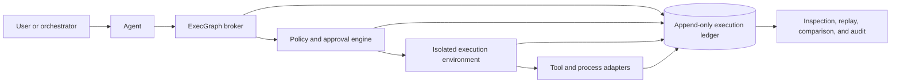

# Agent Execution Ledger

## Product hypothesis

Autonomous agents should not be trusted merely because their conversational transcript looks reasonable. Their executable actions should pass through a mediation layer that enforces policy and records what actually happened.

ExecGraph's longer-term hypothesis is an agent-independent execution broker with three responsibilities:

1. **Mediation:** the agent cannot execute commands, access secrets, or reach external systems except through declared capabilities.
2. **Isolation:** untrusted work runs inside a constrained container or microVM rather than directly on the host.
3. **Provenance:** every material action becomes part of an append-only causal graph.

## Conceptual architecture



The graph is dynamic. It is produced by the run rather than requiring every action to be known beforehand.

## Causal record

A useful ledger would distinguish several levels of observation:

| Level | Examples |
| --- | --- |
| Agent | model request, model response, tool selection, delegated subtask |
| Tool | tool name, validated arguments, policy decision, approval |
| Process | executable, arguments, working directory, parent process, exit cause |
| Data | files read, files changed, artifacts produced, content hashes |
| Network | destination, protocol, policy rule, request metadata |
| Resources | CPU time, memory, duration, process count, output volume |

Edges would express relationships such as `caused_by`, `spawned`, `read_from`, `wrote_to`, `derived_from`, `approved_by`, and `blocked_by_policy`.

## Example event envelope

This is a design sketch, not an implemented wire format:

```json
{
  "event_id": "evt_01...",
  "run_id": "run_01...",
  "parent_event_id": "evt_00...",
  "occurred_at": "2026-03-09T18:42:10.114Z",
  "kind": "process.completed",
  "subject": {
    "executable": "/usr/bin/cmake",
    "argv": ["cmake", "--build", "build"]
  },
  "policy": {
    "decision": "allowed",
    "capability": "workspace.execute"
  },
  "result": {
    "exit_code": 0,
    "stdout_artifact": "sha256:...",
    "filesystem_diff": "sha256:..."
  }
}
```

Sensitive values would require structured redaction before persistence. A complete ledger must not become a new secret-exfiltration system.

## Security boundary

The execution graph is not itself a sandbox. A production system would need a real isolation boundary, for example a hardened container or microVM, plus:

- default-deny filesystem and network policies
- scoped, short-lived capabilities
- a secrets broker that avoids exposing unnecessary credentials to the guest
- CPU, memory, storage, process-count, and time limits
- immutable base images and disposable workspaces
- authenticated, integrity-protected event ingestion
- clear separation between the agent, broker, policy authority, and audit store
- resistance to log tampering and truncation

## Replay has limits

An execution ledger can support inspection and partial replay, but exact deterministic replay cannot be assumed. Network responses, clocks, randomness, concurrency, external services, package registries, and model outputs may all change.

The practical goal should be reproducible evidence:

- content-address important inputs and artifacts
- record versions and environment identity
- preserve external responses when policy allows
- label nondeterministic boundaries explicitly
- distinguish replayed observations from newly executed effects

## Prototype relationship

The current C++ prototype implements only early runtime foundations: controlled child-process creation, process-group ownership, timeouts, captured streams, graph relationships, structured lifecycle events, and SQLite persistence for graph definitions.

It does **not** currently mediate an external coding agent, isolate untrusted code, persist the full event stream, capture filesystem or network provenance, or enforce capabilities. Those are the central requirements of the stronger product hypothesis.
